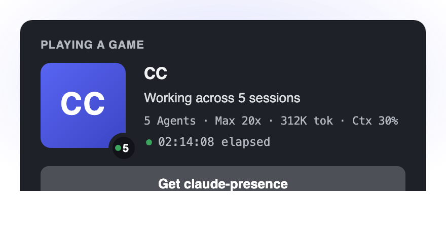

<div align="center">

# claude-presence

**One Discord Rich Presence card for *all* your Claude Code sessions — live, on macOS.**

[](./LICENSE)
[](https://github.com/jaymadeapp/claude-presence/releases)
[](https://github.com/jaymadeapp/homebrew-tap)
[](#prerequisites)
[](https://github.com/sponsors/jaymadeapp)



</div>

A Rust daemon for macOS that merges the live activity of **all** your running
Claude Code sessions into a **single** Discord Rich Presence card — project,
branch, current tool activity, model, plan, token total, context %, optional cost,
and how many sessions are running — updated in real time.

Discord allows one presence per application per user, so every session is folded
into one card (never one card per session); when several sessions are active the
card shows how many.

> The card shows the bold name **"CC"** — Discord blocked the names "Claude" and
> "Claude Code" — with **"Claude Code"** appearing as the tooltip when someone
> hovers the large image.

> **TL;DR** — `brew install jaymadeapp/tap/claude-presence && claude-presence install`.
> One Discord card for all your Claude Code sessions. No network egress, no bot
> token (local IPC only). macOS-only, free, MIT. By [jaymade](https://claude-presence.com).
> Turn it off anytime with `claude-presence disable`; remove it fully with
> [Uninstall](#uninstall).

## Why claude-presence

Run a handful of Claude Code sessions at once and Discord can only show you *one* —
or nothing useful at all. claude-presence aggregates every live session into a
single, honest card: what you're working on, which model, how many agents, how many
tokens, and a running timer. It does this **without sending anything anywhere** — it
talks to your local Discord desktop app over its IPC socket, with no bot token, no
OAuth, and no network egress. Install it in one line, and rip it out cleanly anytime.

## Features

- **Multi-session aggregation** — all your Claude Code sessions folded into one
  card, with a live count when several run at once.
- **No network egress** — local Discord IPC only; no bot token, no OAuth, no
  outbound connection.
- **Privacy-first** — only structured, sanitized fields ever leave the process;
  prompts, file contents, full paths, and secrets never do.
- **One-line install** — `brew install jaymadeapp/tap/claude-presence` pulls a
  prebuilt binary, no Rust toolchain required.
- **Security-audited** — `0700`/`0600` state dir, basename-only paths, secret
  scrubbing on every emitted field.
- **Reversible install** — chains (never overwrites) your statusLine + hooks, and
  every install action has a tested, exact uninstall.

## Quick start

```sh
brew install jaymadeapp/tap/claude-presence   # installs the prebuilt binary (no Rust toolchain)
claude-presence install                       # wires up launchd + statusLine + hooks, then starts
```

You need the **Discord desktop app** running and **Claude Code** installed. The
`install` step asks whether to hide your project and the running command (see
[Privacy](#privacy)); check everything wired up with `claude-presence doctor`.

That's it — start a Claude Code session and a card appears on your Discord profile.

## Install with Claude Code

Prefer to let Claude Code do it? Paste this prompt:

```text
Set up claude-presence (a Discord Rich Presence for Claude Code) on my Mac:

1. First ask me these two questions and WAIT for my answers:
   - "Show your project name on the Discord card, or keep it hidden?"
   - "Show the command you're currently running, or keep it hidden?"
2. Run: brew install jaymadeapp/tap/claude-presence
3. Run `claude-presence install` with -y (so it doesn't prompt again) and the
   flags matching my answers:
   - project: shown -> --show-project, hidden -> --hide-project
   - command: shown -> --show-command, hidden -> --hide-command
   e.g. for "hide project, show command": claude-presence install -y --hide-project --show-command
4. Make sure the Discord desktop app is running, then run: claude-presence doctor
   and fix any [FAIL] lines you find.

Report the doctor output when done.
```

## Prerequisites

- **macOS** (the only supported platform today).
- The **Discord desktop app**, running and logged in. The daemon talks to Discord
  over its local IPC socket — there is no bot token, OAuth, or network egress.
- **Claude Code** installed (this is what the daemon observes).
- A **Rust toolchain** (stable) — only if you [build from source](#build-from-source);
  Homebrew installs a prebuilt binary and needs no toolchain.

## Turn it off and on

Stop broadcasting without uninstalling — the Discord card is cleared and stays
cleared across reboots until you re-enable:

```sh
claude-presence disable   # alias: off
claude-presence enable    # alias: on
```

## Uninstall

Homebrew only removes the binary — it cannot boot out launchd or unchain your
statusLine/hooks. **Unwire first, then uninstall the binary:**

```sh
claude-presence uninstall
brew uninstall claude-presence
```

### Uninstall with Claude Code

Prefer to let Claude Code do it? Paste this prompt:

```text
Remove claude-presence (the Discord Rich Presence for Claude Code) from my Mac:

1. Run: claude-presence uninstall
   (this unwires launchd + statusLine + hooks and clears the Discord card; it
   keeps your config.toml as user data)
2. Then run: brew uninstall claude-presence
3. Run `claude-presence doctor` if it still resolves, or `which claude-presence`,
   to confirm the binary is gone.

Report what each step printed. If `claude-presence uninstall` prints any [warn]
lines (e.g. statusLine drift), show them to me verbatim — do not try to fix them
yourself.
```

## Discord app setup

A Discord application named **"CC"** is already registered (Discord blocked the
names "Claude" / "Claude Code"), with **client_id `1518007333324587168`**. This is
the default `client_id`, so it works out of the box — no Discord Developer Portal
step is required to get a card.

If you prefer your own application:

1. Open the [Discord Developer Portal](https://discord.com/developers/applications)
   and create an application.
2. Copy its **Application ID** and set it as `client_id` in your config.
3. (Optional) Under **Rich Presence → Art Assets**, upload images and note their
   keys: a `large_image` (the app picture) and a `small_image` (the per-tool badge,
   e.g. keyed `claude`). Put those keys under `[assets]` in your config.

**Images are optional.** With no asset keys set, the card still renders a valid
presence — the images are simply omitted. The bold name on the card is the app name
("CC"); the string **"Claude Code"** appears as the `large_text` tooltip when you
hover the large image.

## How it works

`install` performs three reversible, idempotent steps and then starts the daemon:

1. **statusLine wrapper** — captures your current `~/.claude/settings.json`
   `statusLine.command`, stores it, and points `statusLine.command` at a bundled
   wrapper. The wrapper runs your **stored original** command and passes its output
   straight through (your visible status line is unchanged), and additionally tees
   the statusLine JSON to the daemon. This is what supplies exact cost / context % /
   model.
2. **Lifecycle hooks** — **appends** a forwarder entry into the existing `hooks[]`
   group of each event (`SessionStart`, `PreToolUse`, `PostToolUse`, `Stop`,
   `SubagentStart`, `SubagentStop`) in `settings.json`, preserving your own entries
   (e.g. a `Stop` hook that plays `afplay … Submarine.aiff`). This gives the
   lowest-latency "Running X" the instant a tool starts.
3. **launchd user agent** — writes
   `~/Library/LaunchAgents/com.jakubsladek.claude-presence.plist` and `bootstrap`s
   it into your `gui/<uid>` domain (no root). It runs at login and restarts only on
   crash, with logs under `~/.local/state/claude-presence/logs/`.

Install **chains** your existing statusline and hooks — it never overwrites them —
and re-running it is safe. If any step fails, the steps already applied are rolled
back (in reverse order).

`uninstall` reverses every change, in the exact reverse order:

1. `launchctl bootout gui/<uid>` runs **first** (and before the process exits) so
   launchd cannot relaunch the daemon after it clears the presence, then the plist
   is removed.
2. Hooks: removes **only our exact entry** from each event group by identity; your
   own hook entries are kept byte-for-byte.
3. statusLine: restores your original command exactly **if** `statusLine.command`
   still points at our wrapper; if you changed it since install (drift), your value
   is left untouched and a warning is printed. The wrapper and state files are then
   removed.

Every install action has a tested, exact uninstall. Your `config.toml` is treated
as user data and is left in place.

## The card

The Discord activity is built from the aggregated `PresenceModel`:

| Card field | What it shows |
|---|---|
| `details` (≤128) | Single session: `Working on {project} ({branch})`. Several active: `Working across N sessions` (no project name). An opted-in AI title may be appended. |
| `state` (≤128) | The model, plan, and metrics joined by ` · `, e.g. `Opus 4.8 · Max 20x · 45K tok · Ctx 30%`. Running subagents add an `N×` prefix to the model (e.g. `20× Opus 4.8`). When several sessions run **different** models, the model slot becomes a generic `N Agents` (e.g. `5 Agents`) instead of a single model name. A truncation ladder (abbreviate model → abbreviate plan → drop ctx% → tokens → cost) keeps it within the limit. `plan` shows only if set; `cost` only if enabled. |
| `timestamps.start` | Elapsed timer (epoch **milliseconds**): the focused session's start, or the earliest active session's start in the multi-session card. |
| `assets.large_image` / `large_text` | Your uploaded app picture (if set) + the `Claude Code` hover tooltip (set even when no image). |
| `assets.small_image` / `small_text` | A per-tool badge (if set) + a hover tooltip with the live activity — single session: `Running cargo`, `Editing main.rs` (verb + sanitized target); several active: `N active sessions`. The `small_text` tooltip is sent only when a `small_image` key is set. |
| `buttons` | Ships one `Get claude-presence` button (`https://claude-presence.com`) by default; `https://`-only. Remove with `buttons = []`. Shown to other viewers, not on your own card. |

`Ctx %` is the live context-window fill (latest-request context tokens ÷ the
model's window, e.g. 1M for Opus 4.8). Cost is **off by default** — enable
`[fields] cost = true`, ideally with the statusLine wrapper installed for an exact
running figure rather than the latest-request-only fallback.

**Notes.**

- claude-presence deliberately does **not** set `party.size`. Discord renders it as
  a `(N of M)` suffix that clips the narrow profile card, so the session count is
  surfaced in `details` / `small_text` instead.
- Discord may **not render buttons on your OWN profile** over local IPC — they are
  still visible to other people viewing your profile.

## Configuration

See [`config.example.toml`](./config.example.toml) for every option, grouped and
commented with its default. The daemon loads:

```
~/.config/claude-presence/config.toml
```

Copy the example into place and edit:

```sh
mkdir -p ~/.config/claude-presence
cp config.example.toml ~/.config/claude-presence/config.toml
```

Every field is optional and ships with a safe default, so a missing or invalid
config never crashes the daemon. **Changes take effect on daemon restart** — there
is no hot reload. Restart with:

```sh
launchctl kickstart -k gui/$(id -u)/com.jakubsladek.claude-presence
```

or just re-run `claude-presence install`. State (the daemon socket, logs, the
installed scripts) lives under `~/.local/state/claude-presence` (a `0700` dir;
sensitive files are `0600`).

## Privacy

Baseline sanitization is always on. Transcripts contain your prompts, file paths,
and possibly secrets — none of that ever leaves the process or reaches the daemon's
own logs. Only structured, sanitized fields are emitted, to Discord **and** to logs:

- **Hide the project / the running command** (`[privacy.fields]`). The config
  *defaults* are shown (`project = true`, `command = true`), but `claude-presence
  install` asks whether to hide each with the **prompt** defaulting to *hide* —
  so a default interactive install is privacy-first, while an untouched config is
  not. Set them directly without prompting:
  - `privacy.fields.project = false` collapses the project (and its branch) to a
    generic label.
  - `privacy.fields.command = false` hides the running command in the small-icon
    tooltip (only the bare verb, e.g. "Running", shows).

  The Bash command target is **always** sanitized to a bare program name regardless
  — a leading `VAR=value` env-assignment, a `$(…)` substitution, a path, or a
  secret can never appear on the card.
- **Private mode** (`privacy.redact`, default **off**): when on, only generic /
  sanitized labels are emitted — no project, branch, activity target, AI title,
  model, or metrics. The blunt "hide everything" switch; `install --private` sets it.
- **Bash arguments are dropped by default.** With `privacy.scrub_bash_args = true`
  a fuller command may be shown, but only after secrets (tokens, keys, passwords,
  `Authorization`, `WORD=value` env-assignments, credentialed URLs, long base64/hex
  blobs) are stripped and the result truncated. `privacy.fields.command = false`
  takes precedence and hides the command regardless.
- **AI-generated session title is off by default** (`show_ai_title`); even when
  enabled it is shown only if the project is not blacklisted, and it is secret-scrubbed.
- **Paths are reduced to a basename** — never a full path or your home directory.
- **Project blacklist** (`privacy.blacklist_paths`): listed projects are shown
  generically.
- **The card ships one button by default** — `Get claude-presence` →
  `https://claude-presence.com` — shown to **other viewers** of your profile (not on
  your own card). Buttons must be `https://` (never `file://` or a private/credentialed
  URL); the card and its buttons are public. There is no `--no-button` flag: remove it
  by setting `buttons = []` in `~/.config/claude-presence/config.toml` and restarting
  the daemon (`launchctl kickstart -k gui/$(id -u)/com.jakubsladek.claude-presence`).

### Change privacy with Claude Code

Already installed and want to flip what the card shows? You don't need to edit any
files. Re-running `install` with privacy flags is **idempotent** — it rewrites the
two `[privacy.fields]` toggles (and private mode) and restarts the daemon so the
change takes effect immediately (config has no hot reload). Paste this prompt:

```text
Change the privacy settings of my already-installed claude-presence. Don't edit
any files by hand — re-run the installer, which is idempotent and restarts the
daemon for me.

1. First ask me these THREE questions and WAIT for my answers:
   - "Show your PROJECT name on the Discord card, or hide it?"
   - "Show the COMMAND you're currently running, or hide it?"
   - "Turn on PRIVATE mode (hides everything: project, command, model, and
      metrics)? yes / no"
2. Build a single command with an explicit flag for EVERY axis — never omit one,
   because a flag-less axis defaults to HIDDEN on a non-interactive re-run:
   - project shown  -> --show-project   | project hidden -> --hide-project
   - command shown  -> --show-command   | command hidden -> --hide-command
   - private = yes  -> add --private     | private = no   -> add nothing for it
   Example (show project, hide command, private off):
     claude-presence install -y --show-project --hide-command
   Example (private mode on):
     claude-presence install -y --hide-project --hide-command --private
3. Run that command, then run `claude-presence status` and tell me it succeeded.

Note: --private is a one-way switch via these flags — there is no --no-private. To
turn private mode back OFF, tell me and I'll clear privacy.redact in
~/.config/claude-presence/config.toml and restart the daemon with:
  launchctl kickstart -k gui/$(id -u)/com.jakubsladek.claude-presence
```

## Commands

| Command | What it does |
|---|---|
| `claude-presence install` | Install the launchd agent + chained statusLine wrapper + chained hooks (reversible), then start the daemon. Prompts whether to hide your project / running command; scriptable with `--hide-project`/`--show-project`, `--hide-command`/`--show-command`, `--private`, `-y`/`--non-interactive`. |
| `claude-presence uninstall` | Fully revert everything `install` set up (leaves your `config.toml`). |
| `claude-presence enable` (`on`) | Re-load the launchd agent after a `disable`. |
| `claude-presence disable` (`off`) | Unload the launchd agent and clear the Discord card without uninstalling (survives reboot). |
| `claude-presence run` | Run the daemon in the **foreground** (the same code launchd runs; useful for debugging). |
| `claude-presence status` | Show detected live sessions (pid, project, branch), whether a Discord IPC socket is present, and whether a daemon is already running. |
| `claude-presence doctor` | Diagnose the install with `[PASS]`/`[WARN]`/`[FAIL]` lines + hints: Discord socket, statusLine wiring, hooks wiring (e.g. `6/6`), launchd plist, config validity, single-instance conflicts, detected sessions, and the buttons-on-own-profile caveat. |

(There is also an internal `forward` subcommand used by the chained scripts to pipe
events to the daemon socket; it is not part of the user-facing surface.)

## Build from source

```sh
cargo build --release
```

The binary lands at `target/release/claude-presence`. Put it somewhere on your
`PATH` (or invoke it by full path); `install` records the absolute path of the
binary that ran it, so launchd and the chained scripts always call the same one.

## Troubleshooting

```sh
claude-presence doctor
```

Each check prints `[PASS]`/`[WARN]`/`[FAIL]` with an actionable hint (e.g. "Discord
not running — start the Discord desktop app", "wrapper not installed — run
`claude-presence install`"). A common case: no card appears because Discord is not
running or no Claude Code session is active — both show as `WARN`, not errors.

## Support / Sponsor

claude-presence is free and MIT-licensed, and it'll stay that way. If it earns a
spot on your Discord profile and you'd like to say thanks, you can
[sponsor **@jaymadeapp**](https://github.com/sponsors/jaymadeapp) — think
buy-me-a-coffee for the morale, entirely optional. Stars on the
[repo](https://github.com/jaymadeapp/claude-presence) and bug reports help just as
much.

## By jaymade

Built by Jakub ([jaymade](https://claude-presence.com)). More at
[claude-presence.com](https://claude-presence.com).

## License

MIT — see [LICENSE](./LICENSE).
